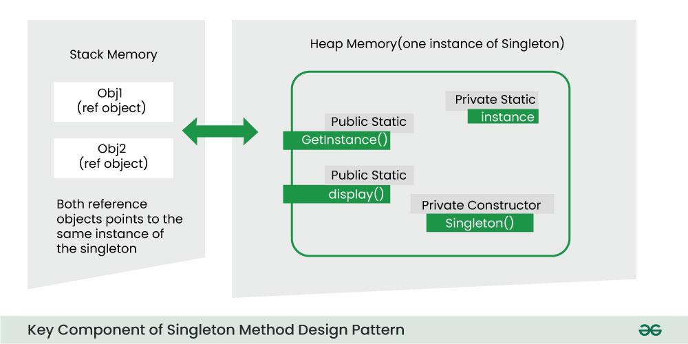
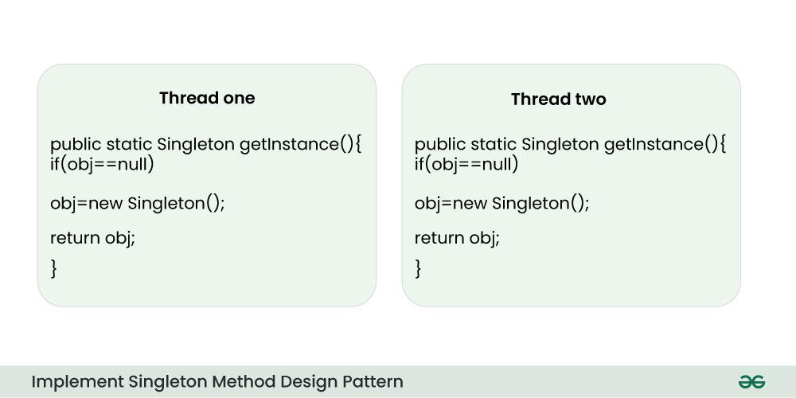

# Singleton Method Design Pattern

The Singleton Method Design Pattern ensures a class has only one instance and provides a global access point to it. It’s ideal for scenarios requiring centralized control, like managing database connections or configuration settings. This article explores its principles, benefits, drawbacks, and best use cases in software development.

## Table of Contents

- [What is Singleton Method Design Pattern?](#what-is-singleton-method-design-pattern)
- [When to use Singleton Method Design Pattern?](#when-to-use-singleton-method-design-pattern)
- [Initialization Types of Singleton](#initialization-types-of-singleton)
- [Key Component of Singleton Method Design Pattern](#key-component-of-singleton-method-design-pattern)
- [Implementation of Singleton Method Design Pattern](#implementation-of-singleton-method-design-pattern)
- [Different Ways to Implement Singleton Method Design Pattern](#different-ways-to-implement-singleton-method-design-pattern)
- [Use Cases for the Singleton Design Pattern](#use-cases-for-the-singleton-design-pattern)
- [Advantages of the Singleton Design Pattern](#advantages-of-the-singleton-design-pattern)
- [Disadvantages of the Singleton Design Pattern](#disadvantages-of-the-singleton-design-pattern)

## What is Singleton Method Design Pattern?

The Singleton method or Singleton Design pattern is one of the simplest design patterns. It ensures a class only has one instance and provides a global point of access to it.


### Singleton Design Pattern Principles

Below are the principles of the Singleton Pattern:

- **Single Instance**: Singleton ensures that only one instance of the class exists throughout the application.
- **Global Access**: Provides a global point of access to that instance.
- **Lazy or Eager Initialization**: Supports creating the instance either when needed (lazy) or when the class is loaded (eager).
- **Thread Safety**: Implements mechanisms to prevent multiple threads from creating separate instances simultaneously.
- **Private Constructor**: Restricts direct instantiation by making the constructor private, forcing the use of the access point.

## When to use Singleton Method Design Pattern?

Use the Singleton Method Design Pattern when:

- **Single Instance Requirement**: You need to ensure that only one instance of a class exists in your application. This is crucial for managing shared resources effectively.
  
- **Global Access Point**: When you want to provide a straightforward way for clients to access that instance from a specific location in your code, making it easier to manage dependencies.

- **Future Extensibility**: If you think you might want to extend the class later, the Singleton pattern is beneficial as it allows for subclassing, enabling clients to work with extended versions without altering the original Singleton.

- **Common Use Cases**: This pattern is often utilized in scenarios such as:
  - **Logging**: Centralizing log entries across the application.
  - **Database Connections**: Managing connections to databases where only one connection should be active.
  - **Caching Data**: Ensuring a single cache instance is available for data storage.
  - **Thread Pools**: Handling thread management where a single instance is necessary to avoid resource contention.

## Initialization Types of Singleton

Singleton classes can be instantiated using two primary methods:

1. **Early Initialization**: 
   - The class is initialized at the time of class loading, regardless of whether it will be used. 
   - **Advantages**: Simplicity in implementation.
   - **Drawbacks**: The class is always initialized, which can lead to unnecessary resource consumption.

2. **Lazy Initialization**:
   - The class is initialized only when it is required, saving resources by avoiding instantiation until necessary. 
   - This method is generally preferred when creating a Singleton class.

## Key Components of Singleton Method Design Pattern

The main key components of the Singleton Method Design Pattern include:



- **Static Member**:
   The Singleton pattern employs a static member within the class. This static member ensures that memory is allocated only once, preserving the single instance of the Singleton class.
   ```
   // Static member to hold the single instance
    private static Singleton instance;
    ```
- **Private Constructor**:
    The Singleton pattern incorporates a private constructor, which serves as a barricade against external attempts to create instances of the Singleton class. This ensures that the class has control over its instantiation process.
    ```
    // Private constructor to
    // prevent external instantiation
    class Singleton {

        // Making the constructor as Private
        private Singleton()
        {
            // Initialization code here
        }
    }
    ```

- **Static Factory Method**:
    A crucial aspect of the Singleton pattern is the presence of a static factory method. This method acts as a gateway, providing a global point of access to the Singleton object. When someone requests an instance, this method either creates a new instance (if none exists) or returns the existing instance to the caller.
    ```
    // Static factory method for global access
    public static Singleton getInstance()
    {
        // Check if an instance exists
        if (instance == null) {
            // If no instance exists, create one
            instance = new Singleton();
        }
        // Return the existing instance
        return instance;
    }
    ```
## Implementation of Singleton Method Design Pattern
The implementation of a Singleton Design Pattern or Pattern Singleton is described in the following class diagram:
<br>
*Implementation of Singleton Method Design Pattern*

The implementation of the singleton Design pattern is very simple and consists of a single class. To ensure that the singleton instance is unique, all the singleton constructors should be made private. Global access is done through a static method that can be globally accesed to a single instance as shown in the code.
```
/*package whatever //do not write package name here */
import java.io.*;
class Singleton {
    // static class
    private static Singleton instance;
    private Singleton()
    {
        System.out.println("Singleton is Instantiated.");
    }
    public static Singleton getInstance()
    {
        if (instance == null)
            instance = new Singleton();
        return instance;
    }
    public static void doSomething()
    {
        System.out.println("Somethong is Done.");
    }
}

class GFG {
    public static void main(String[] args)
    {
        Singleton.getInstance().doSomething();
    }
}
```
### Output
```
Singleton is Instantiated.
Somethong is Done.
```
The getInstance method, we check whether the instance is null. If the instance is not null, it means the object was created before; otherwisewe create it using the new operator.

## Different Ways to Implement Singleton Method Design Pattern
Sometimes we need to have only one instance of our class for example a single DB connection shared by multiple objects as creating a separate DB connection for every object may be costly. Similarly, there can be a single configuration manager or error manager in an application that handles all problems instead of creating multiple managers.

<br>

Let’s see various design options for implementing such a class. If you have a good handle on static class variables and access modifiers this should not be a difficult task.

### Method 1 – Classic Implementation || Make getInstance() static to implement Singleton Method Design Pattern
```
// Classical Java implementation of singleton
// design pattern
class Singleton {
    private static Singleton obj;

    // private constructor to force use of
    // getInstance() to create Singleton object
    private Singleton() {}

    public static Singleton getInstance()
    {
        if (obj == null)
            obj = new Singleton();
        return obj;
    }
}
```
Here we have declared getInstance() static so that we can call it without instantiating the class. The first time getInstance() is called it creates a new singleton object and after that, it just returns the same object.
```
Note: Singleton obj is not created until we need it and call the getInstance() method. This is called lazy instantiation. The main problem with the above method is that it is not thread-safe. Consider the following execution sequence.
```

This execution sequence creates two objects for the singleton. Therefore this classic implementation is not thread-safe.
### Method 2 || Make getInstance() synchronized to implement Singleton Method Design Pattern
```
// Thread Synchronized Java implementation of
// singleton design pattern
class Singleton {
    private static Singleton obj;
    private Singleton() {}

    // Only one thread can execute this at a time
    public static synchronized Singleton getInstance()
    {
        if (obj == null)
            obj = new Singleton();
        return obj;
    }
}
```
Here using synchronized makes sure that only one thread at a time can execute getInstance(). The main disadvantage of this method is that using synchronized every time while creating the singleton object is expensive and may decrease the performance of your program. However, if the performance of getInstance() is not critical for your application this method provides a clean and simple solution.

### Method 3 – Eager Instantiation || Static initializer based implementation of singleton design pattern
```
// Static initializer based Java implementation of
// singleton design pattern
class Singleton {
    private static Singleton obj = new Singleton();
    private Singleton() {}

    public static Singleton getInstance() { return obj; }
}
```
Here we have created an instance of a singleton in a static initializer. JVM executes a static initializer when the class is loaded and hence this is guaranteed to be thread-safe. Use this method only when your singleton class is light and is used throughout the execution of your program.
### Method 4 – Most Efficient || Use “Double Checked Locking” to implement singleton design pattern
If you notice carefully once an object is created synchronization is no longer useful because now obj will not be null and any sequence of operations will lead to consistent results. So we will only acquire the lock on the getInstance() once when the obj is null. This way we only synchronize the first way through, just what we want. 
```
// Double Checked Locking based Java implementation of
// singleton design pattern
class Singleton {
    private static volatile Singleton obj = null;
    private Singleton() {}

    public static Singleton getInstance()
    {
        if (obj == null) {
            // To make thread safe
            synchronized (Singleton.class)
            {
                // check again as multiple threads
                // can reach above step
                if (obj == null)
                    obj = new Singleton();
            }
        }
        return obj;
    }
}
```
We have declared the obj volatile which ensures that multiple threads offer the obj variable correctly when it is being initialized to the Singleton instance. This method drastically reduces the overhead of calling the synchronized method every time.

### Method 5 – Java Specific || Instantiation through inner class || Using class loading concept

This is one of the ways of implementing Singleton Design Pattern in java. It is specific to java language. Some concepts to understand before implementing singleton design by using this way in java:

- Classes are loaded only one time in memory by JDK.
- Inner classes in java are loaded in memory by JDK when it comes into scope of usage. It means that if we are not performing any action with inner class in our codebase, JDK will not load that inner class into memory. It is loaded only when this is being used somewhere.
```
//using class loading concept
// singleton design pattern

public class Singleton {
    
    private Singleton() {
    System.out.println("Instance created");
    }

      private static class SingletonInner{
      
      private static final Singleton INSTANCE=new Singleton();
    }
    public static Singleton getInstance()
    {
       return SingletonInner.INSTANCE;
    }
}
```
In the above code, we are having a private static inner class SingletonInner and having private field. Through, getInstance() method of singleton class, we will access the field of inner class, and due to being inner class, it will be loaded only one time at the time of accessing the INSTANCE field first time. And the INSTANCE is a static member due to which it will be initialized only once.
## Use Cases for the Singleton Design Pattern
Below are some common situations where the Singleton Design Pattern is useful:

- In applications where creating and managing database connections is resource-heavy, using a Singleton ensures that there’s just one connection maintained throughout the application.
- When global settings need to be accessed by different parts of the application, a Singleton configuration manager provides a single point of access for these settings.
- Singleton helps to centralize control and making it easier to manage the state and actions of user interface components.
- Singleton can effectively organize print jobs and streamlines the process in the systems where document printing is required.
## Advantages of the Singleton Design Pattern
Below are the advantages of using the Singleton Design Pattern:

- The Singleton pattern guarantees that there’s only one instance with a unique identifier, which helps prevent naming issues.
- This pattern supports both eager initialization (creating the instance when the class is loaded) and lazy initialization (creating it when it’s first needed), providing adaptability based on the use case.
- When implemented correctly, a Singleton can be thread-safe, ensuring that multiple threads don’t accidentally create duplicate instances.
- By keeping just one instance, the Singleton pattern can help lower memory usage in applications where resources are limited.

## Disadvantages of the Singleton Design Pattern
Here are some drawbacks of using the Singleton Design Pattern:

- Singletons can make unit testing difficult since they introduce a global state. This can complicate testing components that depend on a Singleton, as its state can influence the test results.
- In multi-threaded environments, the process of creating and initializing a Singleton can lead to race conditions if multiple threads try to create it simultaneously.
- If you later find that you need multiple instances or want to modify how instances are created, it can require significant code changes.
- The Singleton pattern creates a global dependency, which can complicate replacing the Singleton with a different implementation or using dependency injection.
- Subclassing a Singleton can be tricky since the constructor is usually private. This requires careful handling and may not fit standard inheritance practices.


